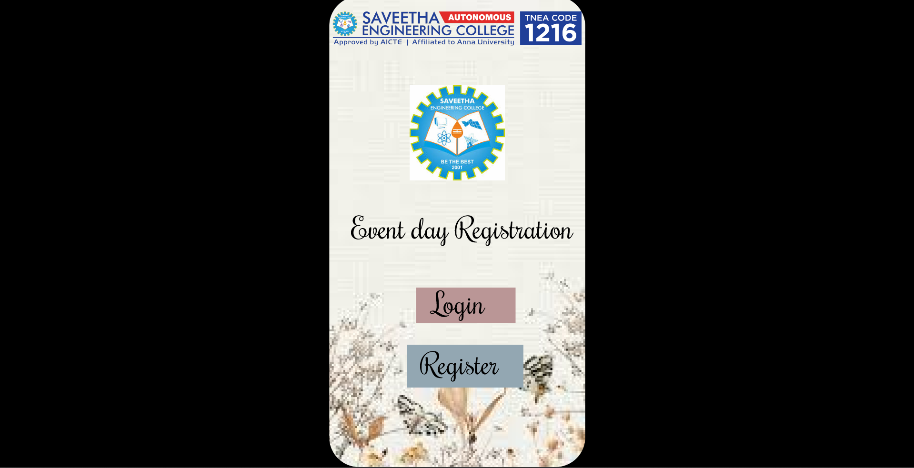
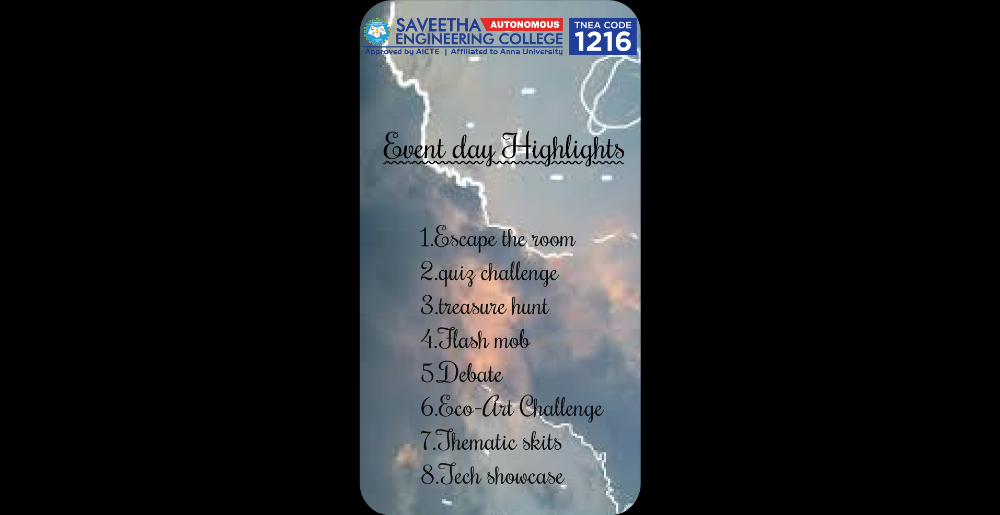
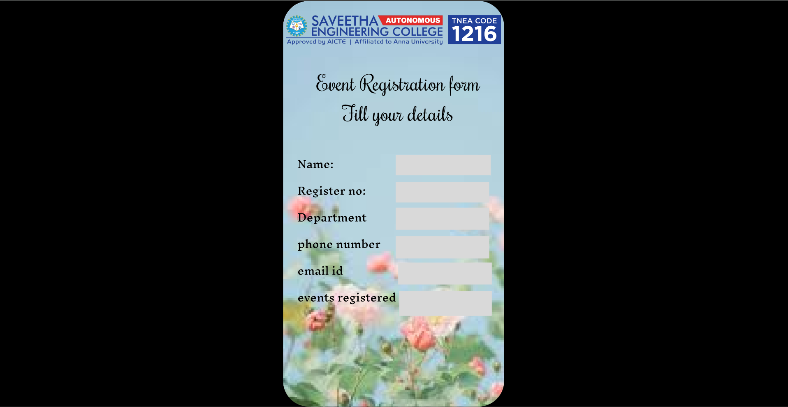
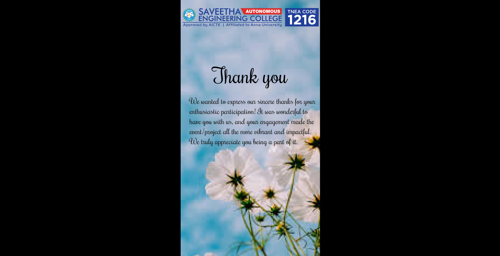

# Ex09 Event Registration Web Application
## Date:21.05.2025

## AIM:
To design, develop and deploy a web application for event registration.

## DESIGN STEPS:

### Step 1:
Create a new frame.

### Step 2:
Select any one preset size of your choice.

### Step 3:
Select the shapes you need.

### Step 4:
Import images as needed.

### Step 5:
Create pages based on your need and link them.

### Step 6:

Validate the HTML and CSS code.

### Step 6:

Publish the website in the given URL.

## DESIGN TOOL:
Figma

## CODE:
```
<div style="width: 430px; height: 932px; position: relative; background: linear-gradient(180deg, #0172B2 0%, #001645 100%); overflow: hidden; border-radius: 50px">
  
  
  <div style="width: 497px; left: 37px; top: 358px; position: absolute; color: black; font-size: 48px; font-family: Rochester; font-weight: 400; word-wrap: break-word">Event day Registration</div>
  <div style="width: 167px; height: 60px; left: 146px; top: 490px; position: absolute; background: #BA9696"></div>
  <div style="width: 195px; height: 72px; left: 131px; top: 586px; position: absolute; background: #93A7B2"></div>
  <div style="width: 160px; height: 50px; left: 173px; top: 484px; position: absolute; color: black; font-size: 48px; font-family: Rochester; font-weight: 400; word-wrap: break-word">Login</div>
  <div style="left: 153px; top: 586px; position: absolute; color: black; font-size: 48px; font-family: Rochester; font-weight: 400; word-wrap: break-word">Register</div>
  
</div>
<div style="width: 430px; height: 932px; position: relative; background: white; overflow: hidden; border-radius: 50px">
  <div style="width: 22px; height: 19.75px; left: 248px; top: 438px; position: absolute; background: white"></div>
  
  
  
  
  <div style="width: 422px; height: 99px; left: 37px; top: 192px; position: absolute; color: black; font-size: 50px; font-family: Rochester; font-weight: 400; text-decoration: underline; word-wrap: break-word">Event day Highlights</div>
  <div style="left: 92px; top: 337px; position: absolute; color: #101010; font-size: 40px; font-family: Rochester; font-weight: 400; word-wrap: break-word">1.Escape the room<br/>2.quiz challenge<br/>3.treasure hunt<br/>4.Flash mob<br/>5.Debate<br/>6.Eco-Art Challenge<br/>7.Thematic skits<br/>8.Tech showcase</div>
</div>
<div style="width: 430px; height: 932px; position: relative; background: white; overflow: hidden; border-radius: 50px">
  <div style="left: 146px; top: 832px; position: absolute; text-align: center; color: white; font-size: 20px; font-family: Roboto; font-weight: 500; word-wrap: break-word">Book Now</div>
  <div style="width: 23px; height: 23.01px; left: 258px; top: 831px; position: absolute; background: white"></div>
  <div style="width: 6.06px; height: 6.07px; left: 266.34px; top: 839.31px; position: absolute; background: white"></div>
  
  
  <div style="width: 412px; height: 59px; left: 18px; top: 134px; position: absolute; text-align: center; color: black; font-size: 40px; font-family: Rochester; font-weight: 400; word-wrap: break-word">Event Registration form</div>
  <div style="width: 412px; height: 59px; left: 18px; top: 134px; position: absolute; text-align: center; color: black; font-size: 40px; font-family: Rochester; font-weight: 400; word-wrap: break-word">Event Registration form</div>
  <div style="width: 297px; height: 33px; left: 75px; top: 193px; position: absolute; text-align: center; color: black; font-size: 40px; font-family: Rochester; font-weight: 400; word-wrap: break-word">Fill your details</div>
  <div style="width: 185px; height: 40px; left: 219px; top: 300px; position: absolute; background: #D9D9D9"></div>
  <div style="width: 182px; height: 40px; left: 219px; top: 353px; position: absolute; background: #D9D9D9"></div>
  <div style="width: 182px; height: 43px; left: 219px; top: 403px; position: absolute; background: #D9D9D9"></div>
  <div style="width: 182px; height: 43px; left: 219px; top: 459px; position: absolute; background: #D9D9D9"></div>
  <div style="width: 182px; height: 43px; left: 224px; top: 510px; position: absolute; background: #D9D9D9"></div>
  <div style="width: 180px; height: 48px; left: 226px; top: 566px; position: absolute; background: #D9D9D9"></div>
  <div style="width: 192px; left: 28px; top: 292px; position: absolute; color: black; font-size: 20px; font-family: Inknut Antiqua; font-weight: 400; word-wrap: break-word">Name:<br/>Register no:<br/>Department<br/>phone number<br/>email id<br/>events registered</div>
</div>
<div>
    
    
    <div style="color: black; font-size: 64px; font-family: Rochester; font-weight: 400; word-wrap: break-word">Thank you</div>
    <div style="width: 402px; height: 226px; color: #181717; font-size: 24px; font-family: Rochester; font-weight: 400; word-wrap: break-word">We wanted to express our sincere thanks for your enthusiastic participation! It was wonderful to have you with us, and your engagement made the event/project all the more vibrant and impactful. We truly appreciate you being a part of it.</div>

</div>
```

## OUTPUT:




## RESULT:
The program to design, develop and deploy a web application for event registration is completed successfully.
